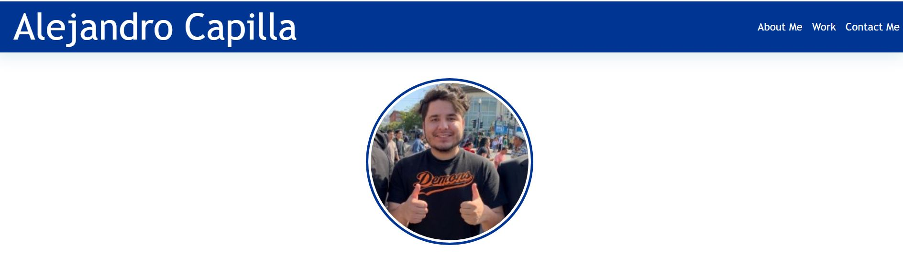
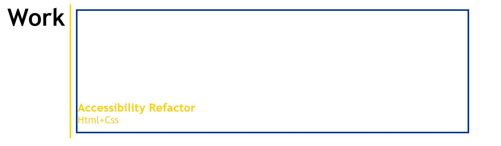
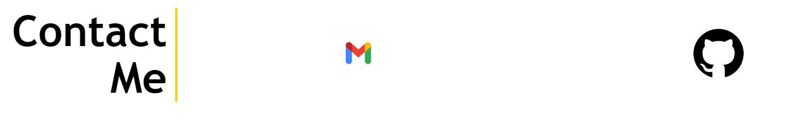

# professional-portfolio
Portfolio created for module 02 challenge
## Description
A portfolio website to be used for showcasing current and future projects in web development. As it stands, one project is posted. 
### Features
- About me

- Projects

- Contact me

### Technolgies Used
Currently using HTML and CSS.

### Installation
Clone repository to local machine and open index file with web browser

### Usage
Serves to demonstrate my knowledge and skills in web development

### License
MIT license